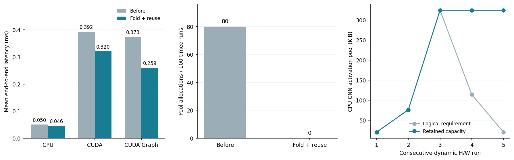

# ONNX 动态 Shape 子图编译与执行支持

2026 夏季 InfiniTensor 训练营 · AI 编译器方向

项目提交人：jnfkdsn

GitHub PR：待创建

完成日期：2026 年 9 月 7 日

实现基线：InfiniTensor `5cb7c1fc`。

当前以 GitHub 用户名署名；正式姓名可使用报告生成脚本的 `--author` 参数替换。

## 项目成果

本项目打通了 ONNX 动态维度声明、运行时 Shape Tensor 求值、C++ 图 Shape 推导、激活内存规划和 CPU/CUDA 执行。基础模型在同一个模型实例上连续完成 `1→2→8→3→1` 的 Batch 变化；真实手写数字 CNN 同时覆盖 Batch、H、W 变化。所有验收输出均与独立 ONNX Runtime Session 比较 Shape 和数值。

| 要求 | 交付结果 |
|---|---|
| 基础完整链路 | Shape→Gather→Unsqueeze→Concat→动态双输入 Reshape→MatMul |
| 方向 1：编译期优化 | 常量折叠与部分求值；典型 Shape 子图从 7 个节点减至 4 个 |
| 方向 2：真实动态 H/W | 真实手写数字数据训练的 CNN；五组 Batch/H/W 连续执行 |
| 方向 3：CUDA | 同一 Shape 准备逻辑接入 CUDA 数据执行，与 CPU/ORT 对齐 |
| 方向 4：CUDA Graph | Shape、拓扑和存储地址参与状态有效性；捕获、重放、历史状态复用回归 |
| 方向 5：内存与性能 | 容量复用开关、真实池分配计数、逻辑需求/容量/分配重叠峰值、四组配置 Benchmark |

上游基线已包含动态内存修复、容量复用和 CUDA Graph LRU 缓存。本项目复用这些机制，新增 Shape 子图与其衔接、必要的算子修正和验证指标，不将已有算法作为本次原创实现。

<!-- pagebreak -->

## 1. 问题与整体设计

原前端将符号维度和匿名未知维度替换为占位值 `1`，没有保留完整输入约束；原 Reshape 只接受导入时已知的目标形状。仅修改输入 Tensor 的 Shape 并调用原 Shape Inference，无法使中间 Shape Tensor 的数值同步变化，也就无法正确准备由其决定形状的数据算子。

本项目采用主机 Shape 阶段与后端数据阶段的顺序执行。NumPy 只在前端做编译期部分求值和测试对齐，运行时 Shape 子图由 C++ CPU kernel 实际计算。推理结果由 InfiniTensor 数据 kernel 产生；ONNX Runtime 仅作为独立参考。

```text
ONNX declarations -> fixed / symbolic / unknown input contracts
                         |
actual input shapes -> validate -> C++ host Shape subgraph
                         |
                 dynamic Reshape target values
                         |
                 Graph::shape_infer()
                         |
        activation memory planning / capacity reuse
                         |
        upload prepared Shape tensors and copy inputs
                         |
             CPU / CUDA / CUDA Graph data execution
                         |
                      outputs
```

### 1.1 动态维度表示

`InputDim` 是不可变描述，保存 fixed(value)、symbolic(name)、unknown 三类维度。ONNX 的 `HasField` 区分未赋值与数值字段，避免把显式的 `0` 与未知维度混淆。实际执行时，C++ Tensor 仍保存具体 Shape，无需引入完整符号表达式系统。

例如 `["batch", 3, "height", "width"]` 中只有三个符号维度允许变化。`set_input` 在修改图之前验证输入数量、rank、整数范围、固定维度及跨输入同名符号的一致性；`infer(feeds)` 还检查输入名、dtype，并连续化非连续 NumPy 数组。匿名未知维度不产生额外相等约束。

当前运行时输入范围为固定 rank、正 int32 维度。占位 `1` 仅用于初始建图，不作为编译期证明。例如 `Shape([batch,3,unknown])` 中只允许将索引 1 的结果折叠为 3。

### 1.2 Shape 子图识别与求值

前端从 Reshape 的第二个输入反向计算依赖闭包，在 Shape 节点处停止对数据生产者的追踪；同时识别从 Shape 派生的受支持小 Tensor 链。这样，普通 Gather 不会因为算子名字相同就被误判为 Shape 计算。

`GraphObj::evaluateShapeTensor` 将闭包内算子克隆到主机 Tensor 上并调用 CPU kernel。Shape 仅读取输入的元信息，不会为了求 Shape 而把整幅图像复制到 CPU 或执行卷积。每轮缓存本轮已计算的小 Tensor，避免同一个共享子表达式被重复执行。单个 Shape 计算输出限制为 4096 元素。

`GraphObj::shape_infer` 按拓扑顺序更新各算子的输出 Shape；遇到动态 Reshape 时先求出其目标 Tensor。这样可以覆盖 Shape 来自中间数据 Tensor 元信息的情况。错误的目标体积会抛出异常，前端恢复此前的输入 Shape，后续合法输入可以继续使用同一实例。

### 1.3 双输入 Reshape 与算子语义

新增 Reshape 构造路径保留 data、shape 两个真实 Tensor 输入；原静态构造路径继续使用。动态目标必须是一维 int64 Tensor。实现检查一个 `-1` 的自动推导、`0` 对应维度复制、allowzero、体积一致性、零乘积与 `-1` 的歧义，以及维度和元素乘积溢出。语义参考 [ONNX Reshape 规范](https://onnx.ai/onnx/operators/onnx__Reshape.html)。

Shape 输出类型修正为 int64；新增 CPU Shape、Gather、Cast kernel，补充 Concat 的 int32/int64 数据支持与 dtype 校验。Gather 支持负索引，并在真正消费本轮索引时校验范围；CUDA Gather 也处理负索引，在图重放时检查边界。Squeeze 省略 axes 时每轮重新确定单维轴；Unsqueeze 保留原始负轴属性，避免前一次归一化污染后续推导。Shape 与 Gather 的定义分别参考 [Shape 规范](https://onnx.ai/onnx/operators/onnx__Shape.html) 和 [Gather 规范](https://onnx.ai/onnx/operators/onnx__Gather.html)。

## 2. 内存、静态兼容与 CUDA

### 2.1 Shape 更新后的内存规划

求值结果暂存在独立主机 Tensor 中。`dataMalloc` 完成激活内存规划之后，再将本轮 Shape 值写入目标 Tensor。已准备的 Shape Tensor 在生命周期规划中按整轮存活处理，以免上传后被其他激活值的别名存储覆盖。数据执行阶段跳过已经准备的 Shape 算子。

Tensor 的逻辑 Shape/字节数与内存池容量分开维护。池容量不足时采用现有增长策略重新分配；容量足够时保留存储，重新建立符合本轮逻辑大小的视图。权重使用现有独立持久存储，数据输入在本轮规划后重新复制，因此扩大输入不会使用小容量旧视图，缩小输入也不会把上一次多余元素作为本次输出。

新增 `memory_reuse=False` 以每次形状变化后的精确容量作为对照；统计真实激活池分配次数、当前需求、保留容量、峰值容量和新旧池同时存活的峰值字节数。`trim_memory` 复用现有显式缩容机制。对比数据见第 5 节。

### 2.2 静态模型兼容

不含动态 Shape 子图的模型保留原有导入与数据执行路径；静态 Reshape 的构造 API 不变。新增输入契约意味着固定 Batch=1 不再可以冒充动态 Batch，因此两个原测试中的动态模型声明改成了符号 batch；正常静态模型测试保持通过。

涉及 Shape 子图的 `to_onnx` 返回保留符号声明和运行时依赖的原模型语义，避免将本轮具体 Shape 或编译期降级后的属性误导出成永久常量。

### 2.3 CUDA 与 CUDA Graph 集成

CPU 和 CUDA 使用相同的主机 Shape 准备逻辑。CUDA 分配显存后上传小 Shape Tensor，再执行原有 CUDA 数据 kernel。Shape 求值与这些上传发生在 CUDA Graph 捕获之前；捕获和重放的数据图跳过准备好的 Shape 算子。

复用已有 CUDA Graph 缓存的模型身份、拓扑、Tensor Shape、storage ID、offset 和地址检查。新 Shape 会捕获新状态；已出现且存储仍匹配的 Shape 可命中缓存。扩容或显式 trim 改变存储后，受影响状态失效，历史 Shape 在新存储上需要重新捕获。默认缓存容量为 16，保留原有 LRU 淘汰和异常恢复。CUDA Graph 的总体机制参考 [NVIDIA CUDA Programming Guide](https://docs.nvidia.com/cuda/cuda-programming-guide/index.html)。

真实 H/W 模型还暴露了 PoolingObj 缓存旧 n/c/h/w 的问题。本次修正每轮推导更新这些参数，并为 GlobalAveragePool 保留全局池化属性、根据本轮 H/W 更新窗口。这样在 H/W 改变后，CPU 和 cuDNN 使用一致的新参数。

<!-- pagebreak -->

## 3. 编译期优化与真实模型

### 3.1 常量折叠及部分求值

前端对受支持 Shape 子图进行保守部分求值。常量来自 initializer、Constant 和 ONNX 声明中可证明的维度；未知值保持未知。完全确定的节点替换为 initializer，随后删除失去使用者的 Shape 分支。运行时相关部分保留为真实图节点。

验收模型中，weight 的 `[6,4]` Shape 及其 Gather、Unsqueeze 共三个节点可折叠，Shape 节点总数从 7 减为 4，减少 42.86%。另有测试证明，即使输入包含 batch 和匿名未知维度，固定通道维 3 仍可单独求值；它不会被错误地折叠为占位 1。

### 3.2 真实动态 H/W CNN

模型使用三层 Conv-ReLU（通道 1→8→16→32）、GlobalAveragePool、动态 Reshape 和线性分类头，共 6,218 个可训练参数。数据为 [scikit-learn load_digits 提供的真实手写数字](https://scikit-learn.org/stable/modules/generated/sklearn.datasets.load_digits.html)，训练/测试集分别为 1,437/360 张，种子 2026，分层划分，CPU 上训练 80 轮。

原始 8×8 独立测试集准确率为 96.11%。导出的 ONNX 显式声明 batch、height、width 动态维度。仓库附带约 27 KiB 的模型、8 张真实测试图像、对应 PyTorch logits、训练元信息和 SHA256。它是实际训练的分类模型，不是只为 Shape 操作构造的算子拼接图。

五组连续输入为 `[1,1,8,8]→[2,1,12,10]→[4,1,16,16]→[3,1,10,12]→[1,1,8,8]`。自动化测试使用真实图像的最近邻缩放，并在原始分辨率与 PyTorch logits 比较；独立 Demo 使用固定种子的随机数值输入，以检查更广的数值范围。其他分辨率只验证推理等价性，本报告不将 96.11% 扩展解释为这些分辨率的分类准确率。

## 4. 正确性验证

### 4.1 环境与测试结果

实测环境为 AMD Ryzen 9 7945HX、NVIDIA GeForce RTX 4060 Laptop GPU（8 GiB）、WSL2 Linux；推理 Python 3.10.21、NumPy 2.2.6、ONNX 1.22.0、ONNX Runtime 1.23.2、onnxsim 0.7.3，CUDA Toolkit 12.4.131、cuDNN 9.10.2。CPU 对比统一 `OMP_NUM_THREADS=1`，ORT intra-op threads=1。训练环境使用 PyTorch 2.9.0、scikit-learn 1.7.2、ONNX 1.19.1。

| 检查 | 实测结果 |
|---|---|
| 修改前 CPU CTest | 41/41 通过 |
| 最终 CPU CTest | 43/43 通过：42 个 C++ 测试可执行文件，1 个 Python 动态 Shape 注册项 |
| 最终 Python 全套 | 90 项；87 通过，3 跳过，0 失败 |
| 开启 CUDA 的动态 Python 套件 | 8/8 通过，含 CPU 和 CUDA 分支 |
| 相关现有 CUDA CTest | 6/6 通过：Graph、Gather/GatherElements、池化、Reshape、MatMul |
| NVIDIA Compute Sanitizer | 动态套件及 CUDA Gather 重放各报告 0 errors |

新增 C++ 测试覆盖动态目标 Tensor 修改、0/-1、错误体积、多个 -1、非法负维、溢出、dtype、Shape 子图、权重保留、扩缩容、负 Gather 索引、Squeeze 重新推导。Python 测试补充 ONNX 导入契约、部分求值、连续五组 Shape、真实模型、失败后实例恢复、非连续输入、优化开关和 CUDA Graph 缓存/存储失效。三个 Python 跳过项包括默认关闭的 CUDA 分支和现有可选测试；它们不计为通过，CUDA 分支已另行显式执行。

### 4.2 对齐标准与连续运行结果

每个 Demo 都只创建一次 `OnnxStub` 与一次 ORT Session，在循环内复用。每轮检查输出 Shape 完全相同，并调用 `np.testing.assert_allclose(rtol=1e-4, atol=1e-5)`。判据逐元素为绝对误差不超过 `atol + rtol * abs(reference)`，因此最大绝对误差略高于 `1e-5` 并不自动意味着失败；它还取决于对应参考值的大小。整数 Shape 值及 dtype 使用精确比较。

以下全部为最终构建实际测得的最大绝对误差；各后端使用相同模型和同一随机种子输入。

| 次数 | 输入 Shape | 输出 Shape | CPU 最大误差 | CUDA 最大误差 | CUDA Graph 最大误差 |
|---|---|---|---|---|---|
| 1 | [1, 2, 3] | [1, 4] | 4.47e-08 | 4.47e-08 | 4.47e-08 |
| 2 | [2, 2, 3] | [2, 4] | 6.71e-08 | 5.96e-08 | 5.96e-08 |
| 3 | [8, 2, 3] | [8, 4] | 2.38e-07 | 2.38e-07 | 2.38e-07 |
| 4 | [3, 2, 3] | [3, 4] | 2.38e-07 | 2.38e-07 | 2.38e-07 |
| 5 | [1, 2, 3] | [1, 4] | 1.19e-07 | 5.96e-08 | 5.96e-08 |

| 次数 | 输入 Shape | 输出 Shape | CPU 最大误差 | CUDA 最大误差 | CUDA Graph 最大误差 |
|---|---|---|---|---|---|
| 1 | [1, 1, 8, 8] | [1, 10] | 7.63e-06 | 3.81e-06 | 3.81e-06 |
| 2 | [2, 1, 12, 10] | [2, 10] | 1.14e-05 | 7.63e-06 | 7.63e-06 |
| 3 | [4, 1, 16, 16] | [4, 10] | 5.72e-06 | 7.87e-06 | 7.87e-06 |
| 4 | [3, 1, 10, 12] | [3, 10] | 3.81e-06 | 7.63e-06 | 7.63e-06 |
| 5 | [1, 1, 8, 8] | [1, 10] | 3.81e-06 | 7.63e-06 | 7.63e-06 |

原始结果见 `results/cpu_batch.json`、`cuda_batch.json`、`cudagraph_batch.json` 及对应 digits 文件。`validation.json` 汇总测试状态；CTest、unittest 和 Compute Sanitizer 原始日志一并保存，日志仅规范化机器绝对路径和行尾空格。

<!-- pagebreak -->

## 5. 内存与性能结果

### 5.1 测量方法

Benchmark 使用 1,024 个输入特征、16 个输出特征的动态 Reshape+MatMul 模型，比较“折叠关/复用关、折叠开/复用关、折叠关/复用开、折叠开/复用开”四组配置。每组预热一个 `1→2→8→3→1` 序列，再测量 20 个序列，共 100 次计时推理；每次均同步完成并检查 ORT 数值。

准备时间包含输入校验、Shape 求值、图推导和内存规划；数据执行时间仅统计主图调用；端到端时间还包含输入复制和输出复制。报告表使用均值，JSON 同时保存中位数和 P95。数据属于这台 WSL2 笔记本上的一次可复现实验，不将短模型结果外推为所有模型的通用加速比。

| 后端 | 折叠 / 复用 | 准备均值 ms | 数据均值 ms | 端到端均值 ms | 计时段池分配 |
|---|---|---|---|---|---|
| CPU | 关/关 | 0.0199 | 0.0287 | 0.0503 | 80 |
| CPU | 开/关 | 0.0170 | 0.0291 | 0.0478 | 80 |
| CPU | 关/开 | 0.0180 | 0.0288 | 0.0485 | 0 |
| CPU | 开/开 | 0.0156 | 0.0288 | 0.0461 | 0 |
| CUDA | 关/关 | 0.2605 | 0.0736 | 0.3924 | 80 |
| CUDA | 开/关 | 0.1902 | 0.0641 | 0.3084 | 80 |
| CUDA | 关/开 | 0.2386 | 0.0648 | 0.3606 | 0 |
| CUDA | 开/开 | 0.1804 | 0.0763 | 0.3205 | 0 |
| CUDA Graph | 关/关 | 0.2464 | 0.0601 | 0.3733 | 80 |
| CUDA Graph | 开/关 | 0.1886 | 0.0521 | 0.2908 | 80 |
| CUDA Graph | 关/开 | 0.2316 | 0.0366 | 0.3336 | 0 |
| CUDA Graph | 开/开 | 0.1713 | 0.0310 | 0.2595 | 0 |

本轮实验中，完全优化相对两项均关闭时的端到端均值降低：CPU 8.4%、CUDA 18.3%、CUDA Graph 30.5%。100 次计时推理的激活池分配从 80 次减到 0 次；包括初始化与预热的总池分配从 85 次减到 3 次。CUDA Graph 的总捕获次数从 85 次减到 6 次。捕获数大于四种不同 Batch 的数量，是因为初期扩容后，部分历史 Shape 需要在新的存储上重新捕获。



### 5.2 内存统计与取舍

| 后端 | 折叠 / 复用 | 单池容量峰值 KiB | 分配重叠峰值 KiB | 最后保留容量 KiB |
|---|---|---|---|---|
| CPU | 关/关 | 64.59 | 88.86 | 8.15 |
| CPU | 开/开 | 64.55 | 80.73 | 64.55 |
| CUDA | 关/关 | 66.25 | 92.25 | 10.00 |
| CUDA | 开/开 | 65.50 | 82.75 | 65.50 |

表中的“分配重叠峰值”统计当前池与新候选池在重新分配时同时存活的字节数；本 Benchmark 没有向外保留 Tensor 视图。它与单个池的容量峰值分开记录，避免把逻辑输出大小误当成真实存储。统计不包含 Python/ORT、库内部状态、主机小 Tensor 分配及 CUDA Runtime 固定 workspace；既有 CUDA Runtime 默认预留 7 GiB，不能把表中的几十 KiB 宣称为整个 GPU 进程的峰值显存。

容量复用在缩小时保留更多内存，以换取后续不再申请/释放；需要降低保留量时调用 `trim_memory()`。GPU 端到端时间还包含主机 Shape 求值、同步及小 Tensor 上传，这些开销对本实验中的小模型很明显。实测收益主要由更少的 Shape 计算、分配和捕获产生，数据 kernel 本身沿用现有实现。

## 6. 使用与复现

详细构建说明、API 和常见错误见同目录 `README.md`。以下命令从仓库根目录执行，使用已激活的 Python 环境。

```bash
python -m pip install -r examples/dynamic_shape/requirements.txt
cmake -S . -B build/Release -DCMAKE_BUILD_TYPE=Release \
  -DBUILD_TEST=ON -DBUILD_TEST_ONNX=ON -DUSE_CUDA=OFF
cmake --build build/Release -j6
export PYTHONPATH="$PWD/build/Release:$PWD/pyinfinitensor/src"
export OMP_NUM_THREADS=1
ctest --test-dir build/Release --output-on-failure
python examples/dynamic_shape/demo.py
python examples/dynamic_shape/demo.py \
  --model examples/dynamic_shape/artifacts/digits_cnn.onnx
python examples/dynamic_shape/benchmark.py --repeats 20
```

CUDA 使用独立 `build/CUDA` 目录，配置 `-DUSE_CUDA=ON -DCUDNN_ROOT=/path/to/cudnn` 后重新设置 PYTHONPATH。添加 `--device cuda` 选择普通 CUDA，添加 `--cuda-graph` 使用图捕获/重放；`INFINITENSOR_TEST_CUDA=1` 开启自动化 CUDA 用例。逐轮输入调用 `stub.infer({"x": array})`，也可使用 `set_input→copyin_numpy→run→copyout_numpy`。

报告 PDF 由 `scripts/render_dynamic_shape_report.py` 从本 Markdown 生成，嵌入中英文字体；测量图由 `scripts/plot_dynamic_shape_results.py` 从已保存的 JSON 生成。`--author` 可修改报告署名，`--pr` 更新首页真实 PR 地址。

## 7. 支持边界与后续工作

本次验收模型使用 opset 13。基础 Shape 链、常量 axes、整数 Shape 值、动态双输入 Reshape 与 CPU/CUDA 数据执行已覆盖；不宣称完整实现所有 ONNX opset 和算子参数组合。

- 运行时输入要求固定 rank、正维度；完整符号代数和零长度动态输入不在本次范围。
- Shape 的运行时 start/end 切片、运行时 axes、控制流、NonZero 等通用数据依赖 Shape，以及动态 Expand/ConstantOfShape 尚未实现。
- C++ 支持直接赋值的目标 Tensor；OnnxStub 导入直接作为模型输入的目标 Tensor 仍需初始值接口，目前验收范围为从输入实际 Shape 计算出的目标。
- 主机 Shape 计算输出限制为 4096 元素；CUDA 普通 Gather 元数据当前支持最大 rank 4。
- 同一动态实例的准备与执行要求串行调用。动态模型导出保留原 ONNX 语义，不导出任意后端优化变换。
- 符号维度变化合法、固定维度变化报错；错误体积或索引不会当作正常输出继续执行。CUDA 数据 Gather 的非法索引会触发设备错误，应用应停止该次执行。

后续可沿现有依赖闭包加入更多整数 Shape 算子、输入 Shape Tensor 初始值接口及小常量主机缓存；这些属于进一步扩展，不影响本报告列出的基础任务和五个扩展方向验证结果。
